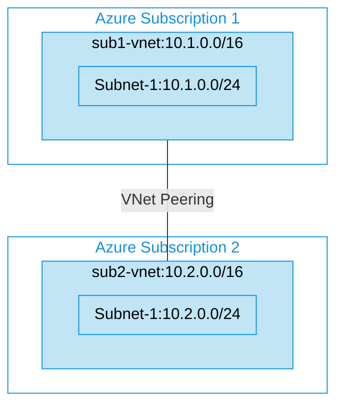

## Architecture
Virtual Network Peering configuration between two different Azure subscriptions.



## Features of the template

- Deploys Virtual Networks in two different Azure subscriptions
- Establishes VNet peering connections between the two Virtual Networks
- Creates necessary resource groups in each subscription
- Configures subnets in each Virtual Network
- Handles cross-subscription networking with tenant-level deployment
- Enables secure and direct connectivity between resources in different subscriptions

## Usage

### Prerequisites
- Access to two different Azure subscriptions
- Permissions to create resources in both subscriptions (at least Contributor role)
- Tenant-level deployment permissions
- Azure CLI or PowerShell installed for deployment

### Deployment

1. Clone the repository containing the Bicep templates
2. Navigate to the vnetpeering-diffrent-subscription directory
3. Update the parameter.json file with your own values:
   - locationSite1: Azure region for deployment (default: japaneast)
   - sub1Id: First Azure subscription ID
   - sub1rgName: Resource group name for the first subscription
   - sub2Id: Second Azure subscription ID
   - sub2rgName: Resource group name for the second subscription

4. Deploy using Azure CLI:
   ```bash
   az login
   az account set --subscription <your-subscription-id>
   az deployment tenant create --location <location> --template-file main.bicep --parameters parameter.json
   ```

   Or deploy using PowerShell:
   ```powershell
   Connect-AzAccount
   Set-AzContext -SubscriptionId <your-subscription-id>
   New-AzTenantDeployment -Location <location> -TemplateFile main.bicep -TemplateParameterFile parameter.json
   ```

5. Verify the deployment in the Azure Portal by checking:
   - The resource groups created in both subscriptions
   - The Virtual Networks created in each resource group
   - The peering connections established between the Virtual Networks