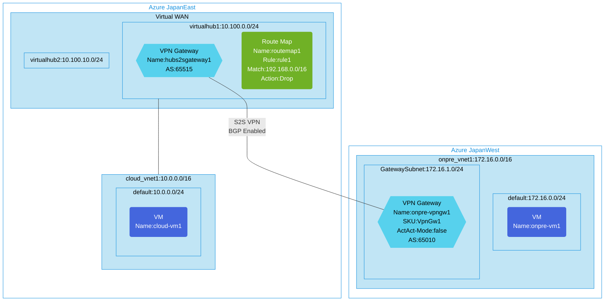

## Architecture
Configuration for Virtual WAN with route maps for route filtering.



## Features of the template

- Deploys a Virtual WAN with two virtual hubs for network connectivity
- Implements route filtering using route maps to control traffic flow
- Creates a cloud virtual network connected to the virtual hub
- Sets up an on-premises virtual network with VPN gateway
- Establishes site-to-site VPN connection with BGP enabled for route exchange
- Configures route maps to filter specific route prefixes (192.168.0.0/16)
- Deploys virtual machines in networks for connectivity testing
- Uses route map with drop action to block specific traffic
- Enables diagnostics logging with Log Analytics workspace (optional)

## Usage

### Prerequisites
- Azure subscription
- Resource group created in a supported region
- Contributor access to the resource group
- Azure CLI or PowerShell installed for deployment

### Deployment

1. Clone the repository containing the Bicep templates
2. Navigate to the vwan-routemap-routefilter directory
3. Update the parameter.json file with your own values:
   - locationSite1: Azure region for cloud resources (default: japaneast)
   - locationSite2: Azure region for on-premises resources (default: japanwest)
   - vmAdminUsername: Username for the VMs
   - vmAdminPassword: Password for the VMs
   - enablediagnostics: Set to true to enable diagnostic logging

4. Deploy using Azure CLI:
   ```bash
   az login
   az group create --name <your-resource-group> --location <location>
   az deployment group create --resource-group <your-resource-group> --template-file main.bicep --parameters @parameter.json
   ```

   Or deploy using PowerShell:
   ```powershell
   Connect-AzAccount
   New-AzResourceGroup -Name <your-resource-group> -Location <location>
   New-AzResourceGroupDeployment -ResourceGroupName <your-resource-group> -TemplateFile main.bicep -TemplateParameterFile parameter.json
   ```