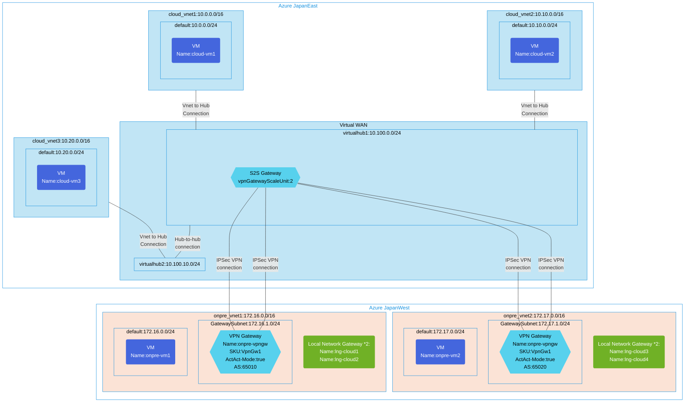

## Architecture
Configuration with S2S VPN connections between Virtual WAN and multiple on-premises networks.



## Features of the template

- Deploys Virtual WAN with two virtual hubs in different regions (Japan East and Japan West)
- Creates S2S VPN Gateway in Virtual WAN for site-to-site connectivity
- Establishes hub-to-hub connectivity between virtual hubs
- Deploys three virtual networks with VMs in Azure (cloud-vnet1, cloud-vnet2, cloud-vnet3)
- Connects Azure virtual networks to virtual hubs using VNet connections
- Creates two simulated on-premises networks (onpre_vnet1, onpre_vnet2) with VPN gateways
- Configures BGP-enabled IPSec VPN connections between Virtual WAN and on-premises networks
- Sets up Local Network Gateways for on-premises connectivity
- Enables Active-Active mode for on-premises VPN gateways
- Configures BGP peering with ASNs 65010 and 65020 for the on-premises networks

## Usage

### Prerequisites
- Azure subscription
- Resource group created in supported regions (Japan East and Japan West)
- Contributor access to the resource group
- Azure CLI or PowerShell installed for deployment

### Deployment

1. Clone the repository containing the Bicep templates
2. Navigate to the vwan-s2s-scenario2 directory
3. Update the parameter.json file with your own values:
   - locationSite1: Primary Azure region (default: japaneast)
   - locationSite2: Secondary Azure region (default: japanwest)
   - vmAdminUsername: Username for the VMs
   - vmAdminPassword: Password for the VMs
   - enablediagnostics: Set to true/false for enabling diagnostics

4. Deploy using Azure CLI:
   ```bash
   az login
   az group create --name <your-resource-group> --location <location>
   az deployment group create --resource-group <your-resource-group> --template-file main.bicep --parameters parameter.json
   ```

   Or deploy using PowerShell:
   ```powershell
   Connect-AzAccount
   New-AzResourceGroup -Name <your-resource-group> -Location <location>
   New-AzResourceGroupDeployment -ResourceGroupName <your-resource-group> -TemplateFile main.bicep -TemplateParameterFile parameter.json
   ```

5. Verify the deployment in the Azure Portal by checking:
   - Virtual WAN and virtual hubs configuration
   - Site-to-site VPN connections between Virtual WAN and on-premises networks
   - Virtual network connections to the virtual hubs
   - Hub-to-hub connectivity between virtual hubs
   - VPN gateways in on-premises networks
   - Local Network Gateway configurations
