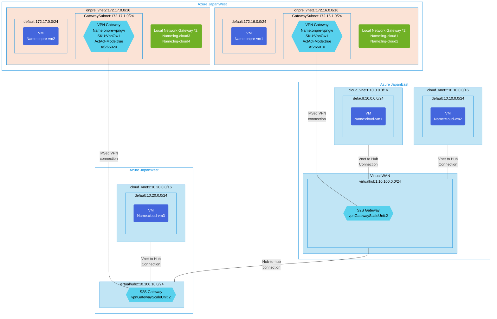

## Architecture
Advanced Site-to-Site VPN configuration with Virtual WAN connecting multiple on-premises locations to cloud VNets across two Azure regions with inter-hub connectivity.



## Features of the template

- Deploys Azure Virtual WAN with dual-hub architecture across two Azure regions (Japan East and Japan West)
- Creates three cloud VNets (two in Japan East, one in Japan West) connected to respective virtual hubs
- Establishes two on-premises VNets with BGP-enabled Active-Active VPN gateways
- Configures Site-to-Site VPN connections between on-premises locations and Virtual WAN hubs
- Enables inter-hub connectivity for seamless communication between regions
- Implements BGP routing with different AS numbers (65010 and 65020) for on-premises sites
- Deploys test VMs in each VNet for connectivity validation
- Uses VpnGw1 SKU gateways with Active-Active mode for high availability
- Supports scalable VPN gateway units (scale unit: 2) for Virtual WAN hubs
- Provides comprehensive network segmentation with proper subnet configurations

## Usage

### Prerequisites
- Azure subscription with sufficient quota for VPN gateways and Virtual WAN resources
- Resource groups created in both Japan East and Japan West regions
- Contributor access to the resource groups
- Azure CLI or PowerShell installed for deployment
- Understanding of BGP configuration and AS numbers for on-premises integration

### Deployment

1. Clone the repository containing the Bicep templates
2. Navigate to the vwan-s2s-scenario3 directory
3. Update the parameter.json file with your own values:
   - locationSite1: Primary Azure region (default: japaneast)
   - locationSite2: Secondary Azure region (default: japanwest)
   - vmAdminUsername: Username for the VMs
   - vmAdminPassword: Password for the VMs (must meet complexity requirements)
   - enablediagnostics: Enable diagnostic logging (default: false)

4. Deploy using Azure CLI:
   ```bash
   az login
   az group create --name <your-resource-group-site1> --location japaneast
   az group create --name <your-resource-group-site2> --location japanwest
   az deployment group create --resource-group <your-resource-group-site1> --template-file main.bicep --parameters parameter.json
   ```

   Or deploy using PowerShell:
   ```powershell
   Connect-AzAccount
   New-AzResourceGroup -Name <your-resource-group-site1> -Location japaneast
   New-AzResourceGroup -Name <your-resource-group-site2> -Location japanwest
   New-AzResourceGroupDeployment -ResourceGroupName <your-resource-group-site1> -TemplateFile main.bicep -TemplateParameterFile parameter.json
   ```

5. Verify the deployment in the Azure Portal by checking:
   - Virtual WAN and virtual hubs in both regions
   - VNet connections to the virtual hubs
   - Site-to-Site VPN connections and their status
   - BGP peering status and route advertisements
   - Inter-hub connectivity between the two virtual hubs
