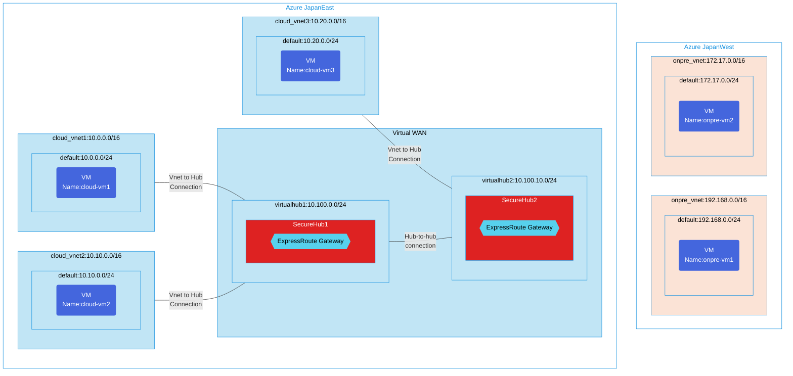

## Architecture
Test Configuration for transit connectivity between ExpressRoute circuits with routing intent and on-premises VNets.



## Features of the template

- Deploys a Virtual WAN environment with two secure hubs in different regions
- Configures ExpressRoute Gateways in both hubs to enable transit connectivity
- Sets up routing intent for ExpressRoute-to-ExpressRoute transit communication
- Creates multiple cloud virtual networks connected to different hubs
- Establishes simulated on-premises virtual networks in a separate region
- Deploys virtual machines in both cloud and on-premises environments for connectivity testing
- Enables hub-to-hub connectivity for cross-region communication
- Provides an environment to test global connectivity scenarios with ExpressRoute circuits

## Usage

### Prerequisites
- Azure subscription
- Resource groups created in supported regions (japaneast and japanwest)
- Contributor access to the resource groups
- Azure CLI or PowerShell installed for deployment
- Existing ExpressRoute circuits or ability to create them during deployment

### Deployment

1. Clone the repository containing the Bicep templates
2. Navigate to the vwan-securehub-ER2ER-transit-add-onpre-vnet directory
3. Update the parameter.json file with your own values:
   - locationSiteEast: Azure East region for deployment (default: japaneast)
   - locationSiteWest: Azure West region for deployment (default: japanwest)
   - vmAdminUsername: Username for the VMs
   - vmAdminPassword: Password for the VMs

4. Deploy using Azure CLI:
   ```bash
   az login
   az group create --name <your-resource-group> --location <location>
   az deployment group create --resource-group <your-resource-group> --template-file main.bicep --parameters parameter.json
   ```

   Or deploy using PowerShell:
   ```powershell
   Connect-AzAccount
   New-AzResourceGroup -Name <your-resource-group> -Location <location>
   New-AzResourceGroupDeployment -ResourceGroupName <your-resource-group> -TemplateFile main.bicep -TemplateParameterFile parameter.json
   ```

5. Verify the deployment in the Azure Portal by checking:
   - The Virtual WAN and secure hubs configuration
   - ExpressRoute Gateways in each hub
   - Cloud virtual networks connected to appropriate hubs
   - On-premises virtual networks and their configuration
   - Virtual machines in both cloud and on-premises environments
   - Routing intent configuration for ExpressRoute transit

For more information about ExpressRoute routing policies, refer to:
https://learn.microsoft.com/en-us/azure/virtual-wan/how-to-routing-policies#expressroute
