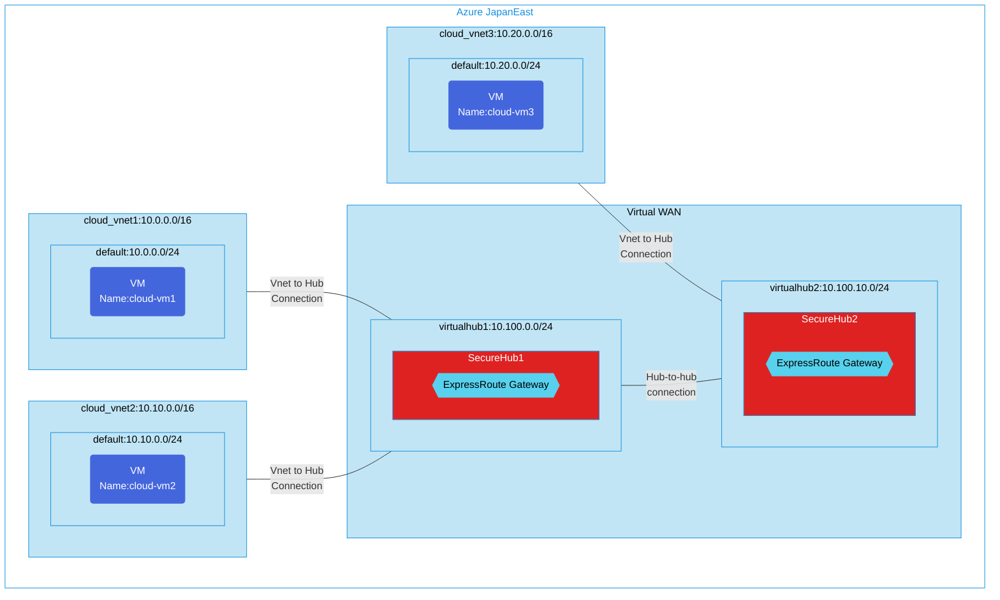

## Architecture
Test Configuration for transit connectivity between ExpressRoute circuits with routing intent.

Learn more about routing policies for ExpressRoute in Virtual WAN: [Microsoft Documentation](https://learn.microsoft.com/ja-jp/azure/virtual-wan/how-to-routing-policies#expressroute)



## Features of the template

- Deploys a Virtual WAN configuration with transit connectivity between ExpressRoute circuits
- Creates secure hubs with routing intent enabled
- Configures ExpressRoute gateways in each secure hub
- Establishes hub-to-hub connections for cross-hub communication
- Deploys multiple virtual networks connected to different hubs
- Creates virtual machines in each VNet for testing connectivity
- Implements the routing policies required for ExpressRoute-to-ExpressRoute transit
- Supports diagnostics for monitoring network traffic

## Usage

### Prerequisites
- Azure subscription
- Resource group created in a supported region
- ExpressRoute circuits (the template connects to existing circuits)
- Contributor access to the resource group
- Azure CLI or PowerShell installed for deployment

### Deployment

1. Clone the repository containing the Bicep templates
2. Navigate to the vwan-securehub-ER2ER-transit directory
3. Update the parameter.json file with your own values:
   - locationSite1: Primary Azure region for deployment (default: japaneast)
   - locationSite2: Secondary Azure region for deployment (default: japanwest)
   - vmAdminUsername: Username for the virtual machines
   - vmAdminPassword: Password for the virtual machines

4. Deploy using Azure CLI:
   ```bash
   az login
   az group create --name <your-resource-group> --location <location>
   az deployment group create --resource-group <your-resource-group> --template-file main.bicep --parameters parameter.json
   ```

   Or deploy using PowerShell:
   ```powershell
   Connect-AzAccount
   New-AzResourceGroup -Name <your-resource-group> -Location <location>
   New-AzResourceGroupDeployment -ResourceGroupName <your-resource-group> -TemplateFile main.bicep -TemplateParameterFile parameter.json
   ```

5. Verify the deployment in the Azure Portal by checking:
   - The Virtual WAN and secure hubs configuration
   - ExpressRoute gateways and their connections
   - Virtual networks connected to the hubs
   - Virtual machines in each VNet
   - Routing policies and intent configuration
