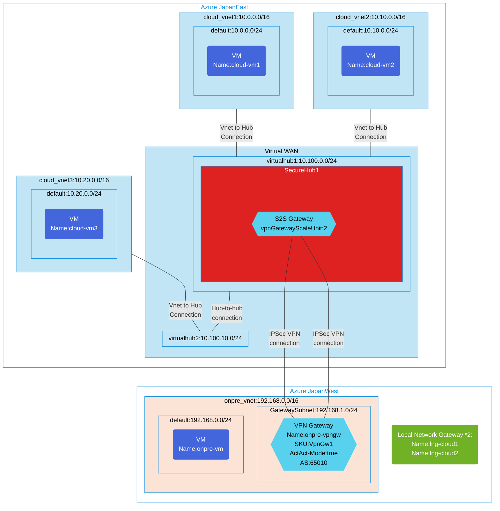

## Architecture
Configuration with Site-to-Site VPN connection between Secure Hub and on-premises Virtual Network.




## Features of the template

- Deploys a Virtual WAN with multiple virtual hubs (virtualhub1, virtualhub2)
- Configures a Secure Hub with Azure Firewall for centralized security
- Creates S2S VPN Gateway for site-to-site connectivity between on-premises and cloud
- Establishes hub-to-hub connections for global network connectivity
- Configures three cloud virtual networks (cloud_vnet1, cloud_vnet2, cloud_vnet3) connected to virtual hubs
- Deploys virtual machines in both cloud and on-premises environments for testing connectivity
- Implements Azure Firewall with network filtering policies
- Supports diagnostic logging for monitoring and troubleshooting

## Usage

### Prerequisites
- Azure subscription
- Resource group created in a supported region
- Contributor access to the resource group
- Azure CLI or PowerShell installed for deployment

### Deployment

1. Clone the repository containing the Bicep templates
2. Navigate to the vwan-securehub-collection1 directory
3. Update the parameter.json file with your own values:
   - locationSite1: Azure region for primary site deployment (default: japaneast)
   - locationSite2: Azure region for secondary site deployment (default: japanwest)
   - vmAdminUsername: Username for the VMs
   - vmAdminPassword: Password for the VMs
   - enablediagnostics: Set to true/false to enable diagnostic logging

4. Deploy using Azure CLI:
   ```bash
   az login
   az group create --name <your-resource-group> --location <location>
   az deployment group create --resource-group <your-resource-group> --template-file main.bicep --parameters parameter.json
   ```

   Or deploy using PowerShell:
   ```powershell
   Connect-AzAccount
   New-AzResourceGroup -Name <your-resource-group> -Location <location>
   New-AzResourceGroupDeployment -ResourceGroupName <your-resource-group> -TemplateFile main.bicep -TemplateParameterFile parameter.json
   ```

5. Verify the deployment in the Azure Portal by checking:
   - The Virtual WAN and virtual hubs configuration
   - Site-to-site VPN gateway connectivity
   - Azure Firewall settings and security policies
   - Virtual network connections to the hubs
   - VM connectivity across the network
