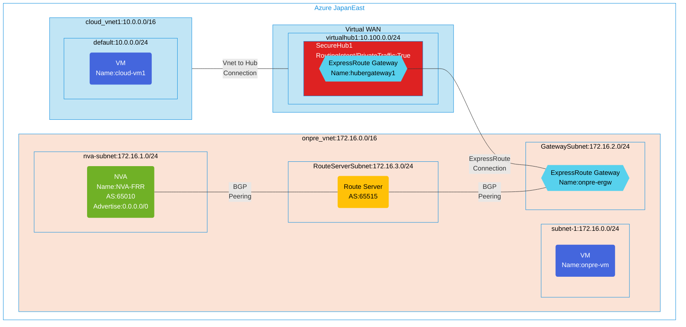

## Architecture

Force tunneling configuration using Azure Virtual WAN Secure Hub with ExpressRoute and Route Server.



## Features of the template

- Deploys Azure Virtual WAN with a secure virtual hub
- Configures Azure Firewall in the hub with Standard tier
- Implements Routing Intent for private traffic through the firewall
- Creates ExpressRoute gateway in the virtual hub
- Deploys on-premises environment with:
  - ExpressRoute gateway for connectivity to Virtual WAN
  - Azure Route Server for BGP peering
  - Network Virtual Appliance (NVA) running FRRouting (FRR) that advertises default route (0.0.0.0/0)
- Configures force tunneling by advertising default route from on-premises NVA through BGP
- Creates cloud virtual network with VM for testing connectivity
- Implements firewall policy with network rules allowing traffic flow
- Optionally enables diagnostic logging to Log Analytics workspace
- Routes all internet-bound traffic from cloud VMs through the on-premises NVA

## Usage

### Prerequisites

- Azure subscription
- Resource group created in a supported region
- Contributor access to the resource group
- Azure CLI or PowerShell installed for deployment

### Deployment

1. Clone the repository containing the Bicep templates
2. Navigate to the vwan-securehub-force-tunnel directory
3. Update the parameter.bicepparam file with your own values:
   - locationSite1: Azure region for deployment (default: japaneast)
   - vmAdminUsername: Username for the VMs
   - vmAdminPassword: Password for the VMs
   - enablediagnostics: Set to true/false to enable diagnostic logging

4. Deploy using Azure CLI:
   ```bash
   az login
   az group create --name <your-resource-group> --location <location>
   az deployment group create --resource-group <your-resource-group> --template-file main.bicep --parameters parameter.bicepparam
   ```

   Or deploy using PowerShell:
   ```powershell
   Connect-AzAccount
   New-AzResourceGroup -Name <your-resource-group> -Location <location>
   New-AzResourceGroupDeployment -ResourceGroupName <your-resource-group> -TemplateFile main.bicep -TemplateParameterFile parameter.bicepparam
   ```

5. Verify the deployment in the Azure Portal by checking:
   - The Virtual WAN and secure hub configuration
   - ExpressRoute gateways in both virtual hub and on-premises VNet
   - Azure Firewall settings and routing intent configuration
   - Route Server and its BGP peering with the NVA
   - NVA (FRR) configuration and default route advertisement
   - Virtual network connection between cloud VNet and virtual hub
   - The deployed VMs in both cloud and on-premises environments
   - Verify that traffic from cloud-vm1 to the internet is routed through the on-premises NVA

## How Force Tunneling Works

1. The NVA running FRRouting (FRR) is configured to advertise the default route (0.0.0.0/0) via BGP
2. Azure Route Server learns this route from the NVA and propagates it to the on-premises ExpressRoute gateway
3. The ExpressRoute gateway advertises this route to the Virtual WAN hub
4. The Virtual WAN hub's routing intent ensures that private traffic goes through the Azure Firewall
5. The default route is propagated to the cloud VNet, causing all internet-bound traffic to be routed through the ExpressRoute connection to on-premises
6. Traffic flows: Cloud VM → Virtual Hub → ExpressRoute → On-premises VNet → NVA → Internet
