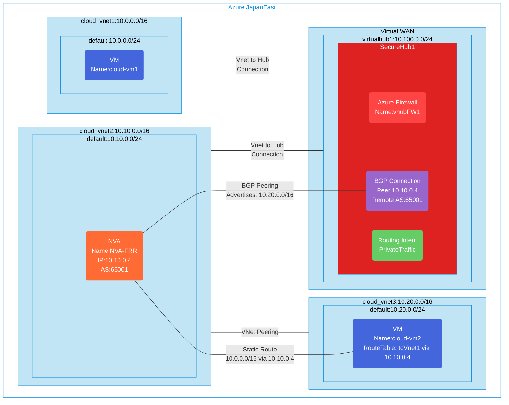

## Architecture
Secure hub configuration with routing intent and BGP peering enabled in Azure Virtual WAN topology. This template demonstrates advanced routing scenarios where an NVA (Network Virtual Appliance) establishes BGP peering with the Virtual WAN hub to advertise custom routes.



## Features of the template

- Deploys Azure Virtual WAN with a secure virtual hub
- Configures Azure Firewall in the hub with Standard tier
- Implements Routing Intent for private traffic through the firewall
- Creates three virtual networks: two connected to the hub and one peered to an NVA network
- Deploys an NVA (Network Virtual Appliance) running FRRouting in cloud_vnet2
- Establishes BGP peering between the NVA and the Virtual WAN hub
- Configures custom routing where traffic from vnet3 to vnet1 goes through the NVA
- Sets up VNet peering between cloud_vnet2 and cloud_vnet3 for direct connectivity
- Implements advanced routing scenarios for traffic steering and inspection
- Configures firewall policies with network rules allowing traffic flow
- Optionally enables diagnostic logging to Log Analytics workspace
- Deploys Ubuntu VMs for connectivity testing in each virtual network

## BGP Configuration Details

### NVA Configuration (FRRouting)
- **ASN**: 65001
- **BGP Neighbors**: 10.100.0.69, 10.100.0.70 (Virtual Hub Route Server)
- **Advertised Routes**: Static route for 10.20.0.0/16
- **Route Maps**: Configured to filter Azure ASNs and bogon ASNs

### Virtual Hub BGP Connection
- **Connection Name**: bgp-connection-1
- **Peer IP**: 10.10.0.4 (NVA IP address)
- **Remote ASN**: 65001
- **Hub ASN**: 65515 (Azure default)

## Routing Scenarios

This template demonstrates several advanced routing scenarios:

1. **Hub-Spoke Connectivity**: cloud_vnet1 connects to virtualhub1 for standard hub-spoke routing
2. **BGP Route Advertisement**: NVA advertises routes to the hub via BGP
3. **Custom Traffic Steering**: Traffic from cloud_vnet3 to cloud_vnet1 is directed through the NVA using static routes
4. **VNet Peering**: Direct connectivity between cloud_vnet2 and cloud_vnet3 via VNet peering
5. **Firewall Integration**: Routing Intent ensures private traffic flows through Azure Firewall

## Usage

### Prerequisites
- Azure subscription
- Resource group created in a supported region
- Contributor access to the resource group
- Azure CLI or PowerShell installed for deployment

### Deployment

1. Clone the repository containing the Bicep templates
2. Navigate to the vwan-securehub-routing-intent-bgp-peer-env directory
3. Update the parameter.json file with your own values:
   - locationSite1: Azure region for deployment (default: japaneast)
   - vmAdminUsername: Username for the VMs
   - vmAdminPassword: Password for the VMs (must meet Azure complexity requirements)
   - enablediagnostics: Set to true/false to enable diagnostic logging

4. Deploy using Azure CLI:
   ```bash
   az login
   az group create --name <your-resource-group> --location <location>
   az deployment group create --resource-group <your-resource-group> --template-file main.bicep --parameters parameter.json
   ```

   Or deploy using PowerShell:
   ```powershell
   Connect-AzAccount
   New-AzResourceGroup -Name <your-resource-group> -Location <location>
   New-AzResourceGroupDeployment -ResourceGroupName <your-resource-group> -TemplateFile main.bicep -TemplateParameterFile parameter.json
   ```

5. The deployment will take approximately 30-45 minutes to complete

### Post-Deployment Verification

1. **Verify BGP Peering Status**:
   - Check the Virtual Hub BGP connections in Azure Portal
   - Verify BGP peer status is "Connected"

2. **Test Connectivity Scenarios**:
   - SSH to cloud-vm1 and test connectivity to cloud-vm2
   - SSH to cloud-vm2 and verify it can reach both other VMs
   - Check routing tables on the VMs to understand traffic paths

3. **Verify Routing**:
   - Check effective routes on VM network interfaces
   - Verify that traffic from vnet3 to vnet1 uses the NVA as next hop
   - Confirm BGP route advertisements in the Virtual Hub

4. **Monitor Traffic Flow**:
   - Use Azure Firewall logs to monitor traffic flow through the hub
   - Check NSG flow logs for traffic patterns
   - Verify BGP route propagation using Azure Route Server diagnostics

### Testing Commands

Once deployed, you can test the routing scenarios:

```bash
# SSH to cloud-vm2 (in vnet3) and trace route to cloud-vm1
ssh vmAdminUsername@<cloud-vm2-public-ip>
traceroute 10.0.0.4  # Should show path through NVA (10.10.0.4)

# SSH to NVA and check BGP status
ssh vmAdminUsername@<nva-public-ip>
sudo vtysh -c "show bgp summary"
sudo vtysh -c "show ip route"
```
