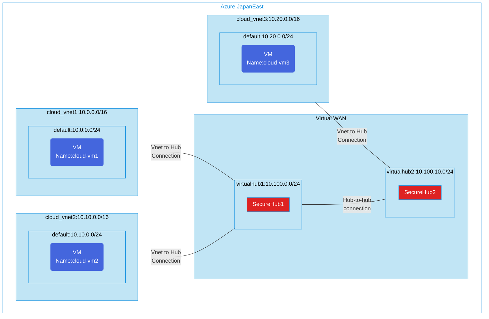

Secure hub configuration with routing intent enabled

```mermaid
graph TB;
%% Groups and Services

subgraph GR1[Azure JapanEast]
  subgraph GV1[cloud_vnet1:10.0.0.0/16]
      subgraph GVS1[default:10.0.0.0/24]
        CP1("VM<br/>Name:cloud-vm1")
      end
end
  subgraph GV2[cloud_vnet2:10.10.0.0/16]
      subgraph GVS2[default:10.10.0.0/24]
        CP2("VM<br/>Name:cloud-vm2")
      end
end
  subgraph GV3[cloud_vnet3:10.20.0.0/16]
      subgraph GVS3[default:10.20.0.0/24]
        CP3("VM<br/>Name:cloud-vm3")
      end
end
  subgraph GV4[Virtual WAN]
    subgraph GV5[virtualhub1:10.100.0.0/24]
      subgraph SECHUB1[SecureHub1]
end
end
    subgraph GV6[virtualhub2:10.100.10.0/24]
      subgraph SECHUB2[SecureHub2]
end
end
end
end

%% Relation for resources
GV1 --Vnet to Hub <br/>Connection--- GV5
GV2 --Vnet to Hub <br/>Connection--- GV5
GV3 --Vnet to Hub <br/>Connection--- GV6
GV5 --Hub-to-hub <br/>connection--- GV6

%% Groups style
classDef GSR fill:#fff,color:#1490df,stroke:#1490df
class GR1,GR2 GSR

classDef SGV1 fill:#c1e5f5,color:#000,stroke:#1490df
class GV1,GV2,GV3,GV4,GV5,GV6,GVS1,GVS2,GVS3,GVS4 SGV1

classDef SGonpV fill:#fbe3d6,color:#000,stroke:#1490df
class GonpV1,GonpV2,GonpS1,GonpS2 SGonpV

classDef SGSH fill:#de2222,color:#fff,stroke:#1490df
class SECHUB1,SECHUB2 SGSH
 
%% Service Style
classDef SCP fill:#4466dd,color:#fff,stroke:none
class CP1,CP2,CP3,CP4 SCP

classDef SonpCP fill:#4466dd,color:#fff,stroke:none
class ONPCP1,ONPCP2 SonpCP

classDef SLNGW fill:#70b126,color:#fff,stroke:none
class LNGW1,LNGW2 SLNGW

```
